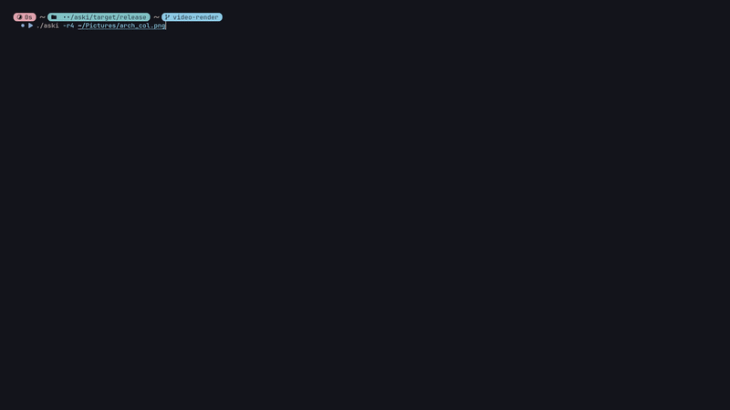

# aski

> True-color terminal renderer for images, GIFs, and videos.

[](https://www.rust-lang.org/) [](LICENSE) [](https://ffmpeg.org/)

aski turns regular media into ANSI block output using full-color escape codes, with aspect-ratio correction, transparency support, streaming video decode, and smooth cached playback inside the terminal.

## Overview

- Render static **images** directly in the terminal
- Play animated **GIFs** natively
- Play **videos** through ffmpeg with buffered streaming decode
- Preserve aspect ratio using terminal cell geometry
- Blend transparency against any CSS-like background color
- Cache rendered ANSI frames for smoother repeat playback
- Rebuild automatically when the terminal is resized

## Quick Start

```sh
aski image.png
aski photo.jpg -b "#1e1e2e"
aski logo.png --opaque
aski animation.gif --loop
aski video.mp4 --precompute --loop
aski video.mp4 --prefetch 16 --fps-limit 30
aski clip.mp4 --no-cache --cell-width 9 --cell-height 20
```

## Examples

### Transparent static image


[Source](https://github.com/klpod221/klpod0s)

### Opaque static image


[Source](https://www.instagram.com/p/CLRnmbSFzq-/)

### Animated GIF


[Source](https://tenor.com/view/tung-tungtung-tungtungtung-sahur-tungtungtungsahur-tungtungsahur-gif-6699270143817937548)

### Video playback


[Source](https://blurbusters.com/hfr-120fps-video-game-recording/)

## Why aski

Most terminal image tools either sacrifice color fidelity, distort the source, or assume static content only. aski is built around a more practical pipeline:

- 24-bit ANSI color output using `█`
- area-weighted downsampling instead of nearest-neighbor shortcuts
- correct handling of non-square terminal cells
- on-demand frame decode for animated media
- ANSI-string caching instead of retaining raw decoded frames in memory

## Feature Highlights

| Feature | What it does |
| --- | --- |
| Aspect-ratio aware scaling | Fits media to the terminal using configurable cell dimensions (`--cell-width`, `--cell-height`) |
| Real transparency | Blends alpha against a configurable background instead of discarding it |
| Fast opaque path | `--opaque` skips alpha math for images without meaningful transparency |
| Streaming video decode | Uses ffmpeg in a background worker with bounded prefetch buffering |
| ANSI frame cache | Reuses rendered terminal frames on repeat playback instead of re-rendering every loop |
| Resize recovery | Detects terminal size changes frame-by-frame and rebuilds output for the new size |
| Alternate-screen playback | Keeps animation redraw isolated and restores the original terminal contents on exit |
| Runtime analytics | `--verbose` reports dimensions, render timing, FPS, cache behavior, and playback summary |

## Playback Model

aski can play animated GIFs natively and most common video formats through ffmpeg.

| Mode | Behavior |
| --- | --- |
| Default | Decode, render, and display frames on demand. Reuse cached ANSI frames on later loops unless `--no-cache` is set |
| `--precompute` | Render all frames before playback starts for smoother first-frame playback |
| `--loop` | Replay until interrupted with `Ctrl+C` |
| `--fps-limit` | Cap playback speed below the source frame rate |
| `--prefetch` | Buffer more decoded video frames ahead of display to absorb decode hiccups |
| `--no-cache` | Disable ANSI frame caching when memory matters more than repeated-loop efficiency |

## Installation

### Pre-built binary

Download the latest executable from [GitHub Releases](https://github.com/voximir-p/aski/releases).

### From source

```sh
cargo install --path .
```

### Manual build

```sh
cargo build --release
./target/release/aski image.png
```

## Usage

```text
Usage: aski [OPTIONS] <IMAGE>
```

### Arguments

| Argument | Description |
| --- | --- |
| `<IMAGE>` | Path to the image, GIF, or video file to render |

### Display options

| Option | Description |
| --- | --- |
| `-b, --background <BACKGROUND>` | Background color for transparent areas. Default: `#15161c` |
| `-o, --opaque` | Skip alpha blending math for faster rendering on opaque sources |
| `-r, --reserve <ROWS>` | Reserve rows at the bottom of the terminal. Default: `2` |

### Scaling options

| Option | Description |
| --- | --- |
| `--cell-width <PX>` | Terminal cell width hint for aspect correction. Default: `10` |
| `--cell-height <PX>` | Terminal cell height hint for aspect correction. Default: `22` |

### Playback options

| Option | Description |
| --- | --- |
| `-l, --loop` | Loop playback until interrupted |
| `-p, --precompute` | Render all frames before playback starts |
| `--fps-limit <FPS>` | Cap playback FPS. `0` means use the source frame rate |

### Performance options

| Option | Description |
| --- | --- |
| `--prefetch <FRAMES>` | Number of prefetched video frames. Default: `8` |
| `--no-cache` | Disable ANSI frame caching |

### Diagnostics

| Option | Description |
| --- | --- |
| `-v, --verbose` | Print runtime diagnostics and playback analytics |

## Background Color Formats

The `--background` option accepts a wide range of CSS-like formats.

| Format | Example |
| --- | --- |
| Hex 6-digit | `#15161c`, `0xff00ff`, `ae6742` |
| Hex 3-digit shorthand | `#abc` |
| `rgb()` | `rgb(21, 22, 28)` |
| `hsl()` | `hsl(235, 14%, 10%)` |
| `hwb()` | `hwb(235 8% 86%)` |
| `lab()` | `lab(8 1 -3)` |
| `lch()` | `lch(8 3 290)` |
| `oklab()` | `oklab(0.11 0.002 -0.015)` |
| `oklch()` | `oklch(0.11 0.015 270)` |

## How It Works

Each terminal cell becomes one output pixel, drawn using the Unicode full block character `█` and a 24-bit ANSI foreground color.

For static images, aski downsamples the source into terminal cells using area-weighted averaging, which produces smoother results than simple nearest-neighbor sampling.

For animated media, frames are decoded as a stream and rendered one by one. When caching is enabled, stored data is the rendered ANSI output rather than the raw RGBA frame buffer, which keeps repeated playback efficient without holding full decoded frame history in memory.

## Supported Formats

| Type | Support |
| --- | --- |
| Static images | Anything supported by the [`image`](https://crates.io/crates/image) crate: PNG, JPEG, WEBP, BMP, TIFF, TGA, and more |
| Animated images | GIF |
| Video | MP4, MKV, AVI, MOV, WebM, FLV, WMV, M4V, TS, OGV via [ffmpeg](https://ffmpeg.org/) |

## Performance Tuning

- Use `--opaque` when transparency is irrelevant
- Increase `--prefetch` if video playback stalls during decode bursts
- Use `--fps-limit` to lower CPU usage on high-FPS sources
- Use `--no-cache` for very long or high-resolution videos if memory is the priority
- Adjust `--cell-width` and `--cell-height` if your terminal font looks stretched or squashed

## Notes

- Animated playback uses the terminal alternate screen buffer
- Resize events invalidate stale frame cache entries and trigger a rebuild
- Verbose analytics are shown inside the playback screen instead of below your shell prompt

## Changelog

Release history is tracked in [CHANGELOG.md](CHANGELOG.md).

## License

aski is licensed under the [GNU General Public License v3.0](https://www.gnu.org/licenses/gpl-3.0.html#license-text). See [LICENSE](LICENSE).
